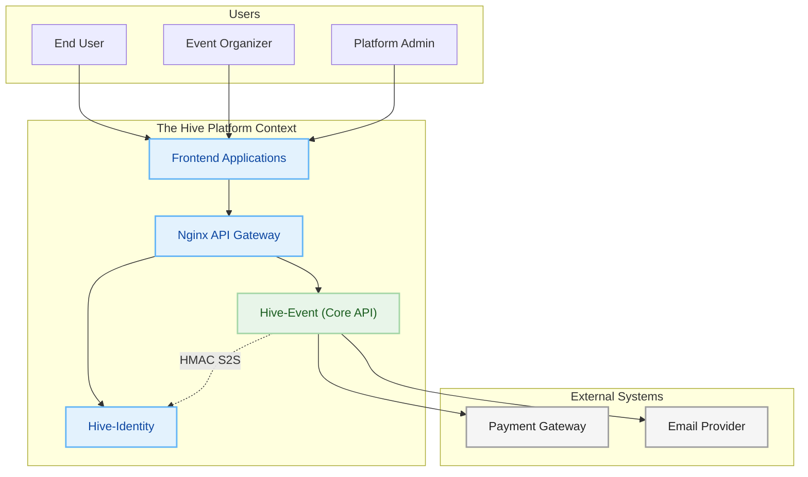
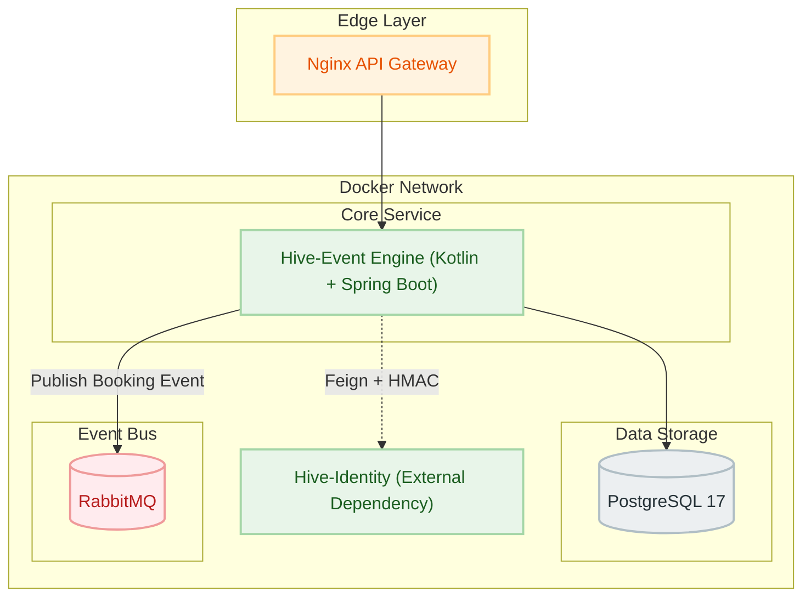
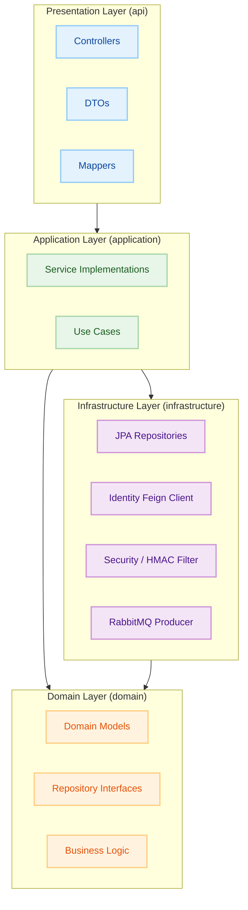
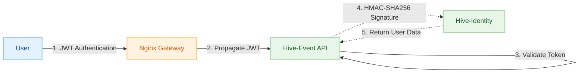

<p align="center">

</p>

<h1 align="center">Hive-Event (Core API)</h1>

<p align="center"><em>The high-performance, concurrency-safe core microservice for managing events, multi-tier ticketing, and live attendee check-ins.</em></p>

<p align="center">


</p>

---

> **Hive-Event** is the central domain engine of the Hive platform. Built with **Kotlin** and **Spring Boot 3**, it
> handles the complex lifecycle of events—from creation and multi-tier ticketing to high-concurrency booking and live
> check-ins. It is designed to be resilient, secure, and event-driven.

---

### 🔗 Associated Repositories

* 👉 **[The-Hive-Project (Main Hub)](https://github.com/Naveen2070/The-Hive-Project)**
* 👉 **[Hive-Identity (Auth Service)](https://github.com/Naveen2070/Hive-Identity)**
* 👉 **[Hive-Forager-UI (Frontend)](https://github.com/Naveen2070/Hive-Forager-UI)**

---

## 🚀 Key Features

* **🎫 Multi-Tier Ticketing:** Support for complex event structures (e.g., "Early Bird", "VIP") with individual pricing, allocation, and validity windows.
* **⚡ Concurrency-Safe Inventory:** Implements **Optimistic Locking** (JPA `@Version`) and `@Retryable` backoff's to
  prevent "Lost Update" problems and overselling during high-traffic ticket drops.
* **🛡️ Zero-Trust Security:**
  * **S2S Auth:** Custom interceptors generate time-sensitive **HMAC-SHA256 signatures** for secure internal data
    fetching from the Identity Service.
  * **Rate Limiting:** IP-based rate limiting using **Bucket4j** (20 req/min) to prevent brute-force and DDoS.
  * **XSS Protection:** Input sanitization using **OWASP Java Encoder**.
* **📱 Smart Check-In System:** QR-code ready endpoint handling **Date Validation** (e.g., checking a Friday pass on Saturday) and **Re-entry Logic** for multi-day events.
* **🐇 Async Notifications (RabbitMQ):** Completely non-blocking notification architecture. Booking confirmations are
  published to the `hive.notifications` exchange for downstream processing.
* **🔍 Advanced Filtering:** Robust event discovery with filtering by title, location, price range, date range, and
  status.
* **🗄️ Database Migrations:** Managed schema evolution using **Liquibase** (PostgreSQL compatible).

---

## 🛠️ Tech Stack

* **Language:** Kotlin (JDK 21)
* **Framework:** Spring Boot 3.5.10
* **Security:** Spring Security, JWT (jjwt 0.13.0), HMAC-SHA256, Bucket4j (8.16.0)
* **Database:** PostgreSQL 17
* **ORM:** Spring Data JPA (Hibernate)
* **Migration:** Liquibase
* **Messaging:** RabbitMQ (AMQP)
* **API Documentation:** OpenAPI 3 / Swagger (SpringDoc 2.8.15)
* **S2S Communication:** Spring Cloud OpenFeign (2025.0.1)
* **Build Tool:** Gradle (Kotlin DSL)

---

## 🏗️ Architecture

The project follows a **Clean Architecture** approach tailored for microservices. Below are the structural diagrams of the Hive-Event engine.

### High-Level Ecosystem



### Container Architecture



### Layered Architecture



### Zero-Trust Security Model



---

## 📂 Project Structure

```text
src/main/kotlin/com/thehiveproject/event
├── api                 # Presentation Layer (Controllers, DTOs, Mappers)
│   ├── controller      # REST Endpoints
│   ├── dto             # Data Transfer Objects
│   ├── error           # Global Exception Handling
│   └── utils           # Security & Input Utilities
├── application         # Application Layer (Service Implementations, Use Cases)
├── domain              # Domain Layer (Interfaces, Domain Models, Business Logic)
├── infrastructure      # Infrastructure Layer
│   ├── persistence     # JPA Entities, Repositories, Projections
│   ├── security        # JWT Filters, HMAC S2S, Rate Limiting
│   ├── notification    # RabbitMQ Producers & Listeners
│   └── client          # Feign Clients for Identity Service
└── configuration       # Spring Configuration (Beans, RabbitMQ, Security)
```

---

## ⚙️ Getting Started (How to Run)

> ⚠️ **IMPORTANT: Microservice Dependency**
> Hive-Event is a dependent microservice. It relies on the *
*[Hive-Identity](https://github.com/Naveen2070/Hive-Identity)** service for JWT authentication and S2S user data
> hydration. To test the full application flow, you must have the Identity Service running simultaneously.

### Prerequisites

* **Java 21** (for manual runs)
* **Docker & Docker Compose**
* **RabbitMQ**
* **PostgreSQL**

### 1. Clone the Repository

```bash
git clone https://github.com/Naveen2070/The-Hive-Project.git
cd The-Hive-Project/services/core-api
```

### 2. Environment Variables (`.env`)

Before running, ensure your environment is configured (or use the main project's `.env`):

```ini
# Database
DB_USERNAME=admin
DB_PASSWORD=SuperSecretPassword123!

# JWT Security
JWT_SECRET=your_super_secret_jwt_key_here

# Zero-Trust S2S Config
INTERNAL_SHARED_SECRET=your_s2s_shared_key
IDENTITY_SERVICE_URL=http://identity-service:8081
```

### 3. Run via Docker Compose

```bash
docker-compose up --build -d
```

---

## 🔌 API Endpoints

### 📊 Dashboard
| Method | Endpoint                | Description                                  | Access       |
|--------|-------------------------|----------------------------------------------|--------------|
| `GET`  | `/api/dashboard/stats`  | Get organizer revenue and ticket stats       | `ORGANIZER`+ |

### 🎫 Events

| Method   | Endpoint                  | Description                                      | Access       |
|----------|---------------------------|--------------------------------------------------|--------------|
| `GET`    | `/api/events`             | Browse events (Filters: title, price, date, etc) | Public       |
| `GET`    | `/api/events/{id}`        | Get event details with ticket tiers              | Public       |
| `GET`    | `/api/events/organizer`   | Get events created by current organizer          | `ORGANIZER`  |
| `POST`   | `/api/events`             | Create a new event                               | `ORGANIZER`+ |
| `PUT`    | `/api/events/{id}`        | Update event details                             | `ORGANIZER`+ |
| `PATCH`  | `/api/events/status/{id}` | Change event status (DRAFT, PUBLISHED, etc)      | `ORGANIZER`+ |
| `DELETE` | `/api/events/{id}`        | Soft delete an event                             | `ORGANIZER`+ |

### 🏷️ Ticket Tiers

| Method   | Endpoint                      | Description                           | Access       |
|----------|-------------------------------|---------------------------------------|--------------|
| `POST`   | `/api/tiers/events/{eventId}` | Add a new ticket tier to an event     | `ORGANIZER`+ |
| `GET`    | `/api/tiers/{tierId}`         | Get ticket tier details               | Auth         |
| `PUT`    | `/api/tiers/{tierId}`         | Update price or allocation            | `ORGANIZER`+ |
| `DELETE` | `/api/tiers/{tierId}`         | Delete tier (only if no tickets sold) | `ORGANIZER`+ |

### 🎟️ Bookings (Concurrency Safe)

| Method  | Endpoint                        | Description                                  | Access       |
|---------|---------------------------------|----------------------------------------------|--------------|
| `POST`  | `/api/bookings`                 | Create a booking (Atomic seat lock)          | Auth         |
| `GET`   | `/api/bookings`                 | Get authenticated user's bookings            | Auth         |
| `PATCH` | `/api/bookings/status/{id}`     | Cancel booking                               | Auth         |
| `POST`  | `/api/bookings/webhook/payment` | Async payment confirmation webhook           | Public       |
| `POST`  | `/api/bookings/check-in`        | **Smart Check-in** (Validates Date/Re-entry) | `ORGANIZER`+ |

---

## 🧪 Testing Concurrency

The booking system handles race conditions on ticket allocations using JPA Optimistic Locking.

1. Create a ticket tier with `allocation = 1`.
2. Send two simultaneous requests to `/api/bookings`.
3. One will succeed; the other will receive a `409 Conflict` or fail after retries.

---

<p align="center">
Built with ❤️, ☕, and distributed systems experiments.🧪<br>
<b>Architected and maintained by <a href="https://github.com/Naveen2070">Naveen</a></b>
</p>
